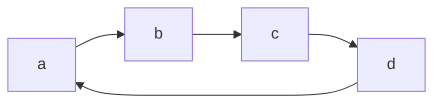
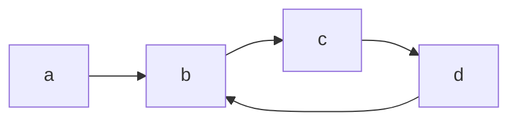

# 141. Linked List Cycle

給定一Linked List，判斷此list是否循環

循環範例：回到起點



循環範例：回到中間某一點



以上兩種都為循環Linked List

## 測資建立：手動建立一份Linked List

```cpp
// struct是題目給的
struct ListNode {
    int val;
    ListNode *next;
    ListNode(int x) : val(x), next(NULL) {}
};

int main() {
    // 將每個節點建立出來
    ListNode* head = new ListNode(0);
    ListNode* node1 = new ListNode(1);
    ListNode* node2 = new ListNode(2);
    ListNode* node3 = new ListNode(3);
    
    // 串聯每個節點
    head->next = node1;
    node1->next = node2;
    node2->next = node3;
    
    // 使用測資，計算答案
    Solution solution;
    int answer = solution.hasCycle(head);
    
    return 0;
}
```


## 解法①：使用額外空間（Hash Table）

開一個set，儲存已經訪問過的節點，每當訪問到一個新的節點，檢查他是否已經出現過了（檢查內存地址是否相同）

* 時間複雜度: $O(n)$ 
* 空間複雜度: $O(n)$

```cpp
class Solution {
public:
    bool hasCycle(ListNode *head) {
        // 使用Hash Set存訪問過的節點指針
        unordered_set<ListNode*> visited;
        
        // 遍歷linked list，先檢查第一個是不是空指針
        while(head) {
            // 檢查visited當中是否出現過
            if(visited.count(head) == 1) {
                // 檢查到了，表示為循環List
                return true;
            }
            
            // 插入目前的指針
            visited.insert(head);
            
            // 查詢完後，往後移動指針
            head = head->next;
        }
        
        // 若找不到，返回false
        return false;
    }
};
```

## 解法②：不使用額外空間

Linked List的快慢指針

* 慢指針：一次移動一個距離
* 快指針：一次移動兩個距離

如果快指針遇到了慢指針，說明此List是環狀結構  
如果快指針沒有遇到慢指針，最後遇到空指針了，說明此List非環狀結構

