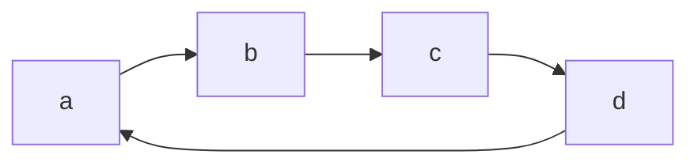
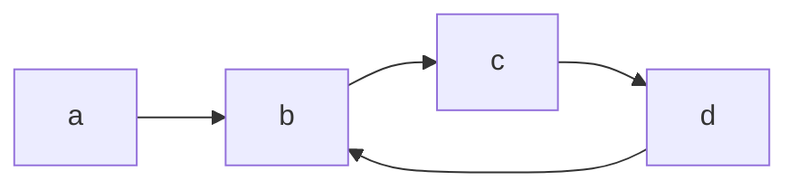

# 141. Linked List Cycle

給定一Linked List，判斷此list是否循環

循環範例：回到起點

```mermaid
flowchart LR
    a-->b
    b-->c
    c-->d
    d-->a
```

循環範例：回到中間某一點

```mermaid
flowchart LR
    a-->b
    b-->c
    c-->d
    d-->b
```

以上兩種都為循環Linked List