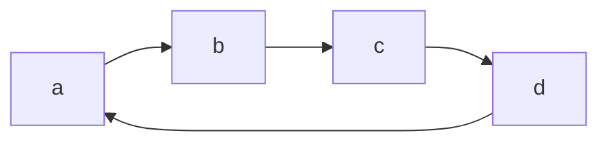
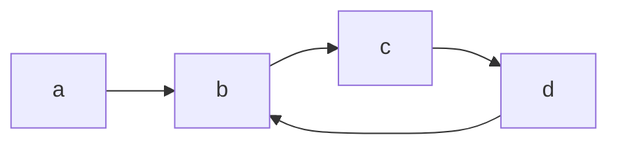

# 141. Linked List Cycle

給定一Linked List，判斷此list是否循環

循環範例：回到起點



循環範例：回到中間某一點



以上兩種都為循環Linked List

## 解題思維

### 使用額外空間

開一個set，儲存已經訪問過的節點，每當訪問到一個新的節點，檢查他是否已經出現過了（檢查內存地址是否相同）

## 測資建立：手動建立一份Linked List

```cpp
// struct是題目給的
struct ListNode {
    int val;
    ListNode *next;
    ListNode(int x) : val(x), next(NULL) {}
};

int main() {
    // 將每個節點建立出來
    ListNode* head = new ListNode(0);
    ListNode* node1 = new ListNode(1);
    ListNode* node2 = new ListNode(2);
    ListNode* node3 = new ListNode(3);
    
    // 串聯每個節點
    head->next = node1;
    node1->next = node2;
    node2->next = node3;
    
    // 使用測資，計算答案
    Solution solution;
    int answer = solution.hasCycle(head);
    
    return 0;
}
```


