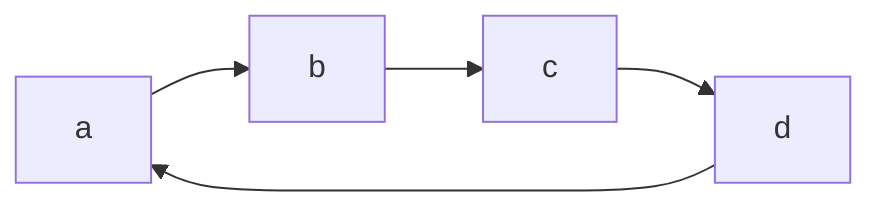
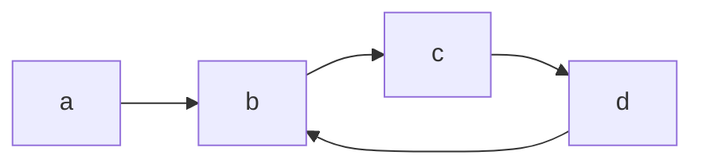

# 141. Linked List Cycle

給定一Linked List，判斷此list是否循環

循環範例：回到起點

```mermaid
flowchart LR
    a-->b
    b-->c
    c-->d
    d-->a
```

循環範例：回到中間某一點

```mermaid
flowchart LR
    a-->b
    b-->c
    c-->d
    d-->b
```

以上兩種都為循環Linked List

## 解題思維

### 使用額外空間

開一個set，儲存已經訪問過的節點，每當訪問到一個新的節點，檢查他是否已經出現過了
