# 160. Intersection of Two Linked Lists

雙指針 (Two Pointers) + 交換頭節點 (Swaping Heads)解題

假設題目範例如下

有兩個Linked List
- List A為4, 1, 8, 4, 5
- List B為5, 6, 1, 8, 4, 5

兩者於Node: 8處重合

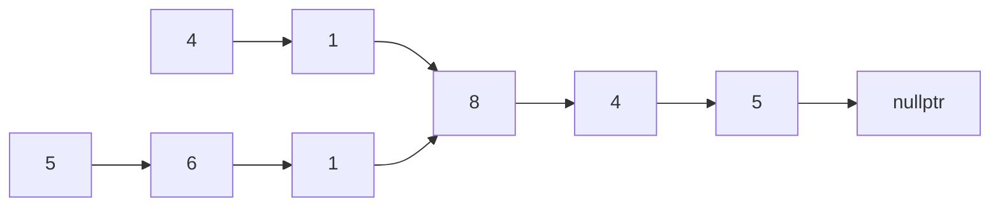

## 解題技巧

1. 標記雙方頭節點，每次一起往右移動一步
2. 假設A節點到nullptr（底端）了，他傳送到B列表的頭，並繼續往右
3. B節點如果到底了也是比照辦理
4. 兩個節點終究會重合（如果有重合點的話）

※之所以要檢查A節點 == nullptr，而非檢查A節點->next == nullptr，是為了考慮非交集的List情形，詳細請看下面非交集的範例

## 有相交節點

首先標記雙方的頭節點，ListA用橘色，ListB用藍色

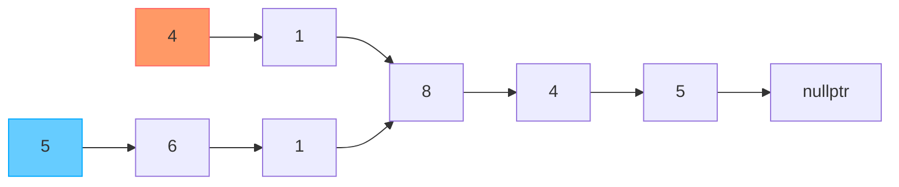

雙方各往右移動一步

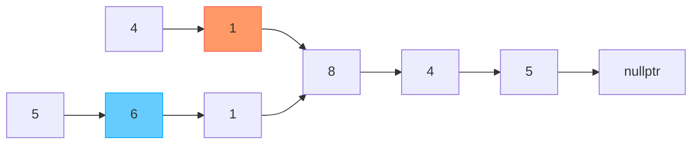

再次往右移動

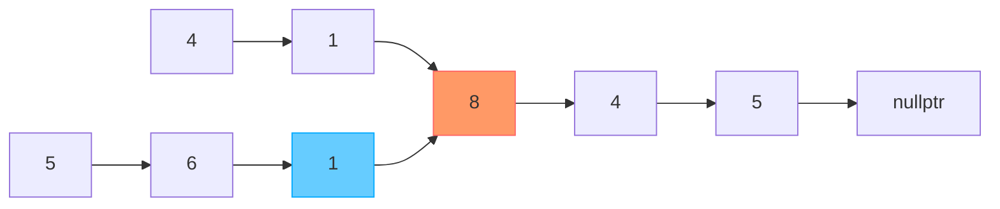

繼續往右

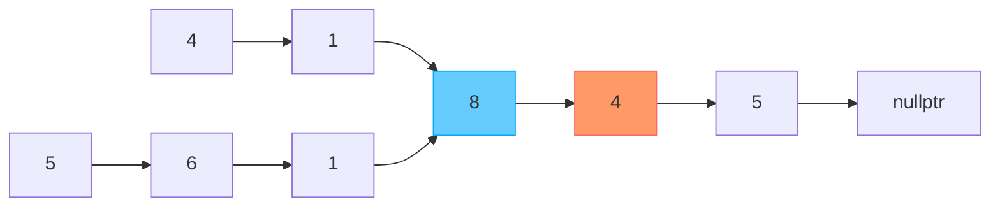

繼續往右

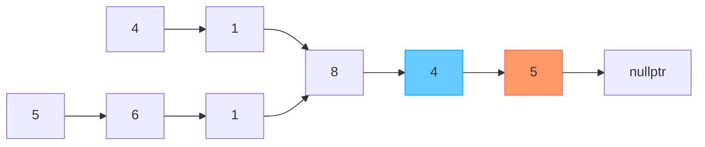

繼續往右

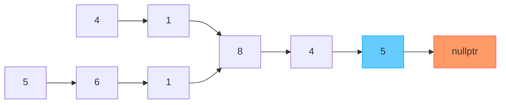

繼續往右…但是橘色變成nullptr了，所以他跳到ListB重來

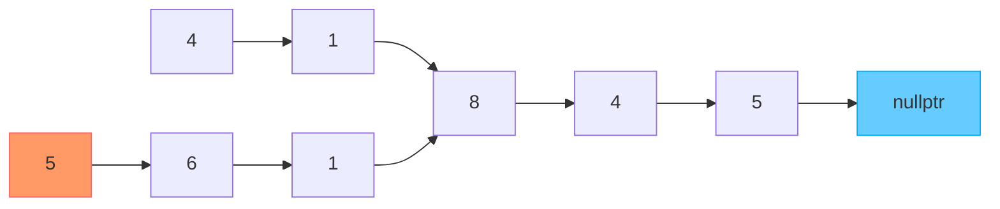

往右…這次換藍色跳到ListA重來

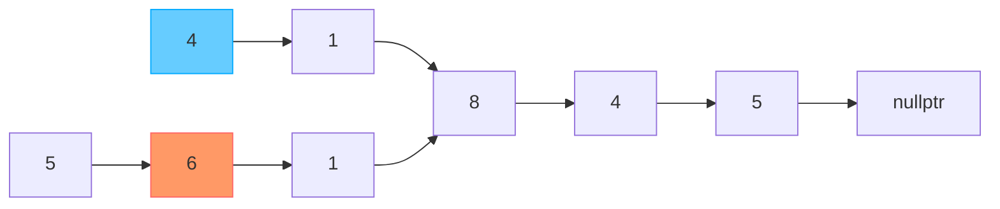

往右

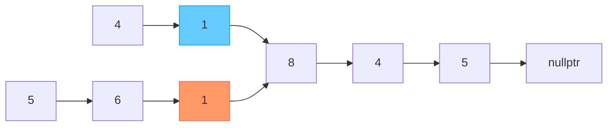

往右，這次橘色跟藍色相遇了

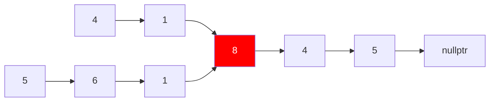

## 無相交節點

假設有範例如下

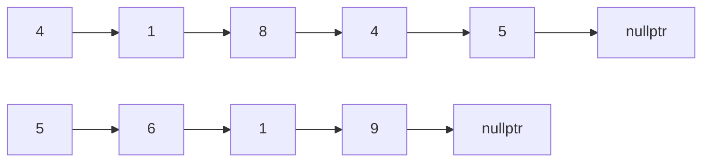

首先，標記雙方移動節點

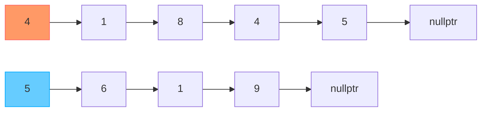

往右移動

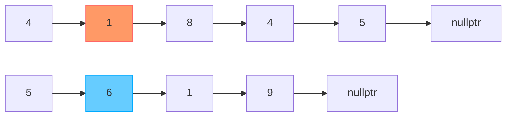

往右移動

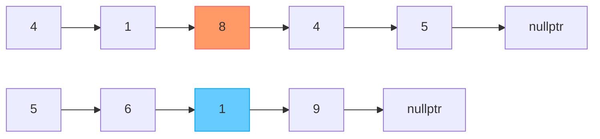

往右移動

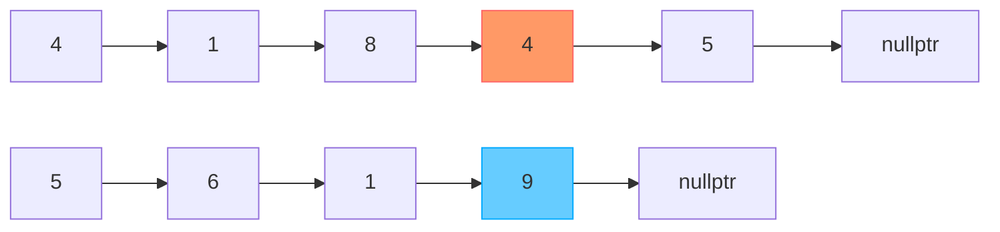

往右移動

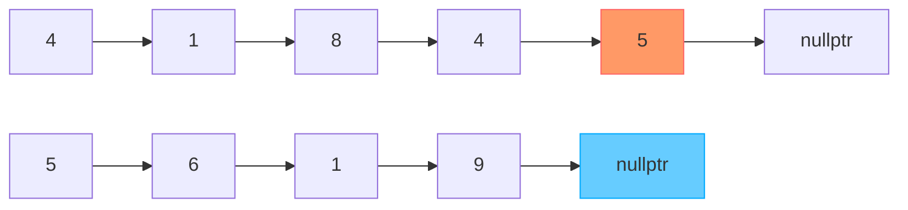

繼續往右，由於藍色抵達了nullptr，藍色跳到了headA

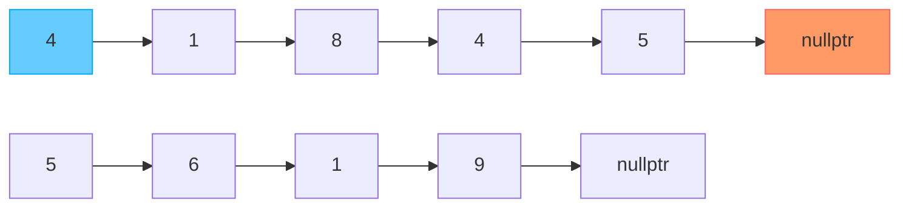

繼續往右，這次換橘色跳到了headB

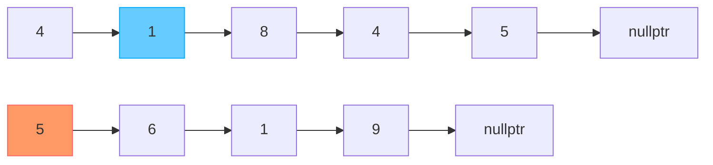

往右

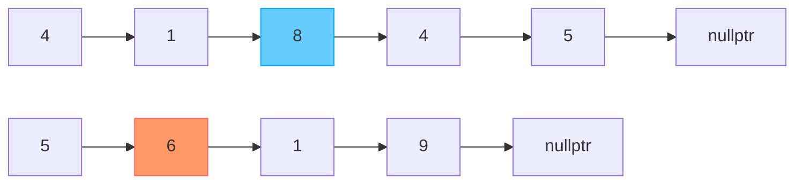

往右

```mermaid
flowchart LR
    a1[4]-->a2[1]
    a2-->a3[8]
    a3-->a4[4]
    a4:::blue-->a5[5]
    a5-->a6[nullptr]
    b1[5]-->b2[6]
    b2-->b3[1]
    b3:::orange-->b4[9]
    b4-->b5[nullptr]

    classDef orange fill:#f96,stroke:#f66
    classDef blue fill:#6cf,stroke:#0af
```

往右

```mermaid
flowchart LR
    a1[4]-->a2[1]
    a2-->a3[8]
    a3-->a4[4]
    a4-->a5[5]
    a5:::blue-->a6[nullptr]
    b1[5]-->b2[6]
    b2-->b3[1]
    b3-->b4[9]
    b4:::orange-->b5[nullptr]

    classDef orange fill:#f96,stroke:#f66
    classDef blue fill:#6cf,stroke:#0af
```

往右，雙方同時抵達了nullptr，因為nullptr的內存位置是`0x0`，所以nodeA == nodeB（即使實際上不是節點相交囧）

```mermaid
flowchart LR
    a1[4]-->a2[1]
    a2-->a3[8]
    a3-->a4[4]
    a4-->a5[5]
    a5-->a6[nullptr]:::blue
    b1[5]-->b2[6]
    b2-->b3[1]
    b3-->b4[9]
    b4-->b5[nullptr]:::orange

    classDef orange fill:#f96,stroke:#f66
    classDef blue fill:#6cf,stroke:#0af
```