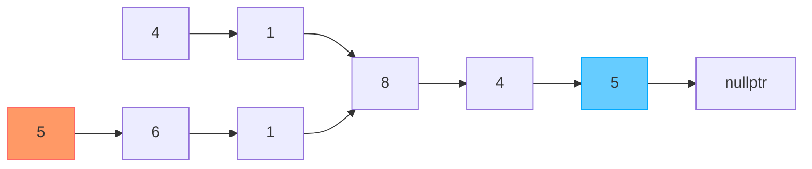
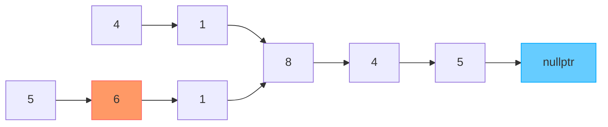
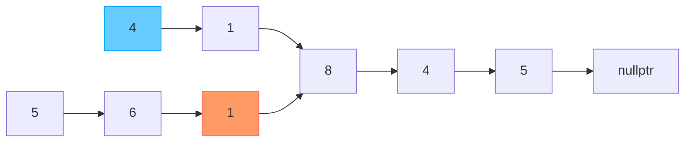
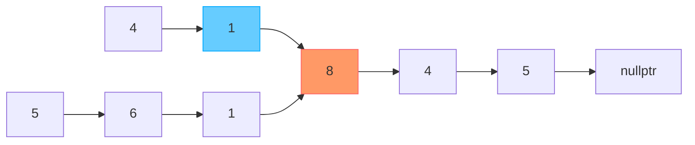

# 160. Intersection of Two Linked Lists

雙指針 (Two Pointers) + 交換頭節點 (Swaping Heads)解題

假設題目範例如下

有兩個Linked List
- List A為4, 1, 8, 4, 5
- List B為5, 6, 1, 8, 4, 5

兩者於Node: 8處重合

## 解題技巧

1. 標記雙方頭節點，每次一起往右移動一步
2. 假設A節點到nullptr（底端）了，他傳送到B列表的頭，並繼續往右
3. B節點如果到底了也是比照辦理
4. 兩個節點終究會重合（如果有重合點的話）

※之所以要檢查A節點 == nullptr，而非檢查A節點->next == nullptr，是為了考慮非交集的List情形，詳細請看下面非交集的範例

首先標記雙方的頭節點，ListA用橘色，ListB用藍色

雙方各往右移動一步

再次往右移動

繼續往右

繼續往右

繼續往右

繼續往右…但是橘色變成nullptr了，所以他跳到ListB重來

往右

往右…這次換藍色跳到ListA重來

往右

往右

往右，這次橘色跟藍色相遇了

