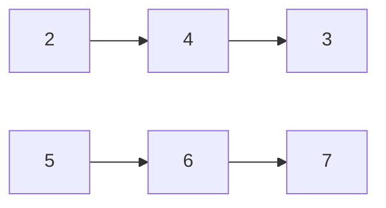

# 2. Add Two Numbers

## 題目概述

給定兩組Linked List，皆為反序數字，計算總和

例如：


342+765=1107，答案為1107

需要考慮的情況：

1. 兩組Linked List的長度不同，例如123+456789
2. 總和具有更多位數：例如99+11=110

題目給定的ListNode

```cpp
struct ListNode {
     int val;
     ListNode *next;
     ListNode() : val(0), next(nullptr) {} // 成員初始化列表，在初始化ListNode()時，建立了名為val值為0、名為next值為nullptr的兩個變數
     ListNode(int x) : val(x), next(nullptr) {}
     ListNode(int x, ListNode *next) : val(x), next(next) {}
};
```

## Linked List解

* 時間複雜度: $O(max(n, m))$
* 空間複雜度: $O(max(n, m))$

`n`是l1的長度，`m`是l2的長度，取最長的Linked List的長度

```cpp
class Solution {
public:
    ListNode* addTwoNumbers(ListNode* l1, ListNode* l2) {
        // 建立dummy，當作索引的第0項
        ListNode dummy(0);
        
        // 建立指針變量tail，紀錄計算當前的最末項
        ListNode* tail = &dummy;
        
        // 進位數carry
        int carry = 0;
        
        
        // 因為l1, l2每計算一位就會往後挪移，全部挪完後就會是nullptr，因此只要當中有人沒到最底，就會持續計算
        while (l1 != nullptr || l2 != nullptr || carry != 0) {
            
            // 加總計算
            int sum = (l1 ? l1->val : 0) + (l2 ? l2->val : 0) + carry;
            
            // 總和模除10，帶入tail的next項
            tail->next = new ListNode(sum % 10);
            
            // 往後移動tail的指向位置
            tail = tail->next;
            
            // 計算carry進位值
            carry = sum / 10;
            
            // 計算完後，l1, l2往後移動（如果後面沒人的話就補nullptr）
            l1 = l1? l1->next : nullptr;
            l2 = l2? l2->next : nullptr;
            
        }
        
        
        return dummy.next;
    }
};
```

測試資料範例

```cpp
int main() {
    cout << boolalpha << endl;
    
    // l1: 2,4,3
    // l2: 5,6,7
    
    ListNode* l1 = new ListNode(2, new ListNode(4, new ListNode(3)));
    ListNode* l2 = new ListNode(5, new ListNode(6, new ListNode(7)));
    

    Solution solution;
    ListNode* answer = solution.addTwoNumbers(l1, l2);
    
    return 0;
}
```
