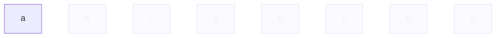
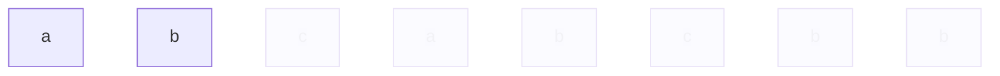
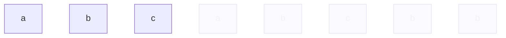
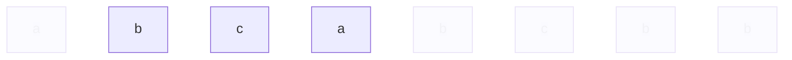
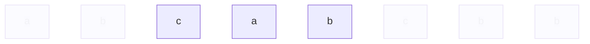
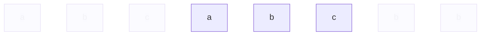
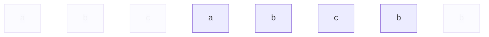
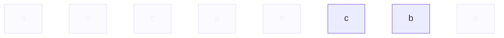
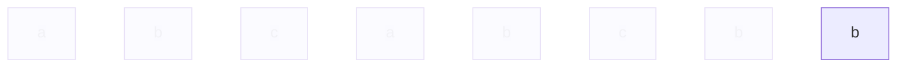

# 3. Longest Substring Without Repeating Characters

## 題目概述

給定一字串，去掉重複出現的字符後，得到出新的字串，計算新字串的長度

## 暴力解

1. 找出所有可能的字符集合，花費時間 $O(n^2)$[^1][^2]
2. 利用Hash Table或者Array，再逐一掃描是否包含重複字符 $O(n)$

總共花費時間（理論上） $O(n^3)$

補充：Leetcode的字符都是ASCII，只有128種不同字元，就算將Leetcode所有的字符組成一獨立不重複的字串，長度最長也就是128，因此：

* 總花費時間（Leetcode實際上）為 $O(128^2 \times n)$
* 空間複雜度（Leetcode實際上）為 $O(128)$


[^1]: 決定substring的起點，往後找出所有可能組合，假設字串為`abcde`，先從`a`開始看，列出`a`、`ab`、`abc`、`abcd`、`abcde`，再從`b`開始看，列出`b`、`bc`、`bcd`、`bcde`，以下類推
[^2]: 實際的複雜度為n×(n+1)/2，類似三角形的底×高/2算法，由於n×(n+1)/2在無限大資料下跟n^2差異不大，因此也可以說他就是n^2級別的算法

## 暴力解優化

優化前面算法，遍歷所有集合的同時，計算算是否重複

### 解題思維

本解法一共有2層迴圈，外層for迴圈，內層while迴圈  
while迴圈是縣市選拔，for迴圈是全國比賽，比賽流程類似這樣：

1. 在比賽開始之前，定義暫時全國第一名為小明，分數為0
2. 舉辦基隆市比賽，選出基隆市冠軍小昌，分數為4
3. 因為4>0，小昌取代小明，暫代全國第一名
4. 舉辦台北市比賽，選出台北市冠軍小哲，分數為3
5. 因為3沒有比4大，小哲無法擊敗小昌，全國第一仍是小昌
6. 以下類推其他全部縣市，經過層層比較，最後選出最高分的全國第一名

假設s為`abbde`

設定一變數`ans`，紀錄全國第一名，初始設定為`0`

### 索引起點`0`
~~（舉辦基隆市比賽）~~

設定索引起點為`0`，`s[0] = a`，尋找以`a`為起點的所有排列  
並且，同時紀錄**不重複字元：j**出現的次數

- `a`: j = 1
- `ab`: j = 2
- `abb`: j = 2
- `abbd`: j = 3
- `abbde`: j = 4

這一輪最大的j得到4，因為4比全國第一名`ans=0`大，讓`ans=4`

### 索引起點`1`
~~（舉辦台北市比賽）~~

往後移動索引為`1`，`s[1] = b`，尋找以b為起點的所有排列，紀錄不重複字元j出現次數

經過一串計算後，得知本輪j最大為`3`  
`3`沒有比`ans=4`大，所以ans還是等於4

繼續計算索引起點`2`、`3`等等，最終得到ans為4

### `seen`紀錄重複出現的字元

前面算`j`時，會利用到`seen`這一vector比對，`seen`會計算已經出現過的字元次數

由於Leetcode字元是ASCII，一共只有128項，因此首先讓`seen`為128個空值的vector

```cpp
vector<int> seen(128);
```

而當回圈計算到`a`時，首先查詢`seen`裡面是否有`a`

```cpp
seen[a];
```

中括號裡面通常是放常數，代表索引，強硬塞給他字符`a`，他會轉換成ASCII的數字，`a`的ASCII碼是`97`，因此實際上會變成

```cpp
seen[97];
```

尋找`seen`當中第97項的值，目前因為128項都是nil，因此會得到nil，也就是沒找到的結果  
因為確定沒找到，認定`a`為尚未出現過的字符，所以將他記錄到`seen`當中，以供下次搜尋使用

### 程式碼欣賞

```cpp
seen[a]++;
```

`a`會變轉化成索引`97`，`seen[97]`原本是空值，`++`後等於`1`，所以`seen[97]`等於了`1`

```cpp
class Solution {
public:
    
    int lengthOfLongestSubstring(string s) {
        
        // 取字串的長度
        int n = s.length();
        
        // 總第一名
        int ans = 0;
        
        for (int i = 0; i < n; ++i) {
            // 建立名為seen的vector，紀錄出現過的字符，因為leetcode的字元總共只有128個，所以一口氣將所有字符的空格都畫出來
            vector<int> seen(128);
            
            // 最長的不重複字元次數
            int j = i;
            
            // 當j還沒觸及s的終點，並且字符s[j]為新出現的字符，往下計算
            while(j < n && !seen[s[j]]) {
                // 因為s[j]出現過了，標記為已出現，s[j]由nil變成1
                seen[s[j]]++;
                
                // 出現了新的不重複字元，j加1
                j++;
                
            }
            
            // 因為開頭定義j=i，造成j初始具有偏移，因此需要再進行補正
            ans = max(ans, j - i);
            
        }
        
        return ans;
    }
};
```

時間複雜度: $O(n \times 128)$  
空間複雜度: $O(128)$

## HashTable / Sliding Window

用滑動視窗移動起點/終點，再用哈希表檢查是否出現過

1. 字串題目為`s`，例如`abcabcbb`
2. 定義終點`j`，讓`j`由`0`開始，每當字串遍歷一次，`j`就會加1
3. 定義起點`i`，`i`由`0`開始，只有當符合條件時，`i`才會加一
4. 定義哈希表`m`，`m`儲存出現過的字元跟他的索引位置
5. 定義`ss`描述當下window，也就是s[i]~s[j]

以`s=abcabcbb`為例

### 當遍歷第一次時

| s[j]代表的字元 | j起點 | i終點 | m哈希表 | ss視窗 |
| -- | -- | -- | -- | -- |
| `a`  | 0 | 0 | `{a: 0}` | `a` |

* `j`起點為`0`  
* `i`終點為`0`
* `m`哈希表：首先檢查`s[j]`有沒有在哈希表裡面，得到結果是NO，因此在哈希表裡面放入`{s[j]: j}`，也就是`{a: 0}`
* `ss`視窗：`s[i]`跟`s[j]`都是`s[0]`，因此得出`a`



### 遍歷第二次時

| s[j] | j起點 | i終點 | m哈希表 | ss視窗 |
| --- | -- | -- | -- | -- |
| `a` | 0 | 0 | `{a: 0}` | `a` |
| `b` | 0 | 1 | `{a: 0, b: 1}`| `ab`|

* `j`終點：只要每遍歷一次就會+1，因此j為`1`  
* `m`哈希表：一樣檢查`s[j]`，沒在裡面，放入哈希表中，m成為了`{a: 0, b: 1}`
* `i`起點：只要s[j]人沒在m裡面就不會動，仍然為`0`
* `ss`視窗：`s[0到1]`代表`ab`



### 遍歷到第三次

| s[j] | j起點 | i終點 | m哈希表 | ss視窗 |
| --- | -- | -- | -- | -- |
| `a` | 0 | 0 | `{a: 0}` | `a` |
| `b` | 0 | 1 | `{a: 0, b: 1}`| `ab`|
| `c` | 0 | 2 | `{a: 0, b: 1, c: 2}`| `abc`|

第三次沒什麼好講的



### 到第四次

| s[j] | j起點 | i終點 | m哈希表 | ss視窗 |
| --- | -- | -- | -- | -- |
| `a` | 0 | 0 | `{a: 0}` | `a` |
| `b` | 0 | 1 | `{a: 0, b: 1}`| `ab`|
| `c` | 0 | 2 | `{a: 0, b: 1, c: 2}`| `abc`|
| `a` | 1 | 3 | `{a: 3, b: 1, c: 2}` | `bca` |

* `j`終點：只要每遍歷一次就會+1，因此j為`3`  
* `m`哈希表：檢查`s[j]`，有查到，因此讓m[j]=s[j]，`a: 3`取代`a: 0`，m成為了`{a: 3, b: 1, c: 2}`
* `i`起點：因為發生了更新事件，需要更新起點，新起點的算法是被刪除的人的index+1，剛剛刪除了s[0]，0+1=1，因此更新為`1`
* `ss`視窗：`s[1到3]`代表`bca`



到第4次時，因為有重複的字元，所以將s[0]刪除了，起點發生了變更，新的起點變成了s[0]右邊的人，也就是s[1]=b

### 到第五次

| s[j] | j起點 | i終點 | m哈希表 | ss視窗 |
| --- | -- | -- | -- | -- |
| `a` | 0 | 0 | `{a: 0}` | `a` |
| `b` | 0 | 1 | `{a: 0, b: 1}`| `ab`|
| `c` | 0 | 2 | `{a: 0, b: 1, c: 2}`| `abc`|
| `a` | 1 | 3 | `{a: 3, b: 1, c: 2}` | `bca` |
| `b` | 2 | 4 | `{a: 3, b: 4, c: 2}` | `cab` |

一樣發生了更新事件，`{b: 4}`取代了`{b: 1}`，刪除了s[1]  
因為是s[1]被刪除，被刪除的index為1，1+1=2，2為新的i



### 第六次

| s[j] | j起點 | i終點 | m哈希表 | ss視窗 |
| --- | -- | -- | -- | -- |
| `a` | 0 | 0 | `{a: 0}` | `a` |
| `b` | 0 | 1 | `{a: 0, b: 1}`| `ab`|
| `c` | 0 | 2 | `{a: 0, b: 1, c: 2}`| `abc`|
| `a` | 1 | 3 | `{a: 3, b: 1, c: 2}` | `bca` |
| `b` | 2 | 4 | `{a: 3, b: 4, c: 2}` | `cab` |
| `c` | 3 | 5 | `{a: 3, b: 4, c: 5}` | `abc` |

`{c: 5}`取代了`{c: 2}`，i起點發生變更，被刪除的index是`{c: 2}`的`2`，2+1=3，3為新的i



### 第七次

第7次的動作比較複雜，首先是終點`j`無條件往後移，範圍變成如下



`s[6]`的字元是`b`，先從`{a: 3, b: 4, c: 5}`當中查找是否出現過`b`，答案是有，我們找到`{b: 4}`  
`b`的新index會取代`{b: 4}`，成為了`{b: 6}`，m成為了`{a: 3, b: 6, c: 5}`

新的起點為這次被刪除的`{b: 4}`的4加一去算，4+1=5，新的起點`i`為`5`



`s[6]`的`b`被刪了，而且拿`s[5]`的`a`一起陪葬（即便`a`沒有出現重複），這是因為題目指定需要找連續最長不重複的字串


| s[j] | j起點 | i終點 | m哈希表 | ss視窗 |
| --- | -- | -- | -- | -- |
| `a` | 0 | 0 | `{a: 0}` | `a` |
| `b` | 0 | 1 | `{a: 0, b: 1}`| `ab`|
| `c` | 0 | 2 | `{a: 0, b: 1, c: 2}`| `abc`|
| `a` | 1 | 3 | `{a: 3, b: 1, c: 2}` | `bca` |
| `b` | 2 | 4 | `{a: 3, b: 4, c: 2}` | `cab` |
| `c` | 3 | 5 | `{a: 3, b: 4, c: 5}` | `abc` |
| `b` | 5 | 6 | `{a: 3, b: 6, c: 5}` | `cb` |

### 第八次

| s[j] | j起點 | i終點 | m哈希表 | ss視窗 |
| --- | -- | -- | -- | -- |
| `a` | 0 | 0 | `{a: 0}` | `a` |
| `b` | 0 | 1 | `{a: 0, b: 1}`| `ab`|
| `c` | 0 | 2 | `{a: 0, b: 1, c: 2}`| `abc`|
| `a` | 1 | 3 | `{a: 3, b: 1, c: 2}` | `bca` |
| `b` | 2 | 4 | `{a: 3, b: 4, c: 2}` | `cab` |
| `c` | 3 | 5 | `{a: 3, b: 4, c: 5}` | `abc` |
| `b` | 5 | 6 | `{a: 3, b: 6, c: 5}` | `cb` |
| `b` | 7 | 7 | `{a: 3, b: 7, c: 5}` | `b` |

一樣發生了新`{b: 7}`取代了舊b`{b: 6}`事件，m成為了`{a: 3, b: 7, c: 5}`
因為刪除了`{b: 6}`，6+1=7，新的i起點為`7`



### 評選最長的

綜合看以上八次回圈，整理ss視窗結果如下

* 第1次：`a`
* 第2次：`ab`
* 第3次：`abc`
* 第4次：`bca`
* 第5次：`cab`
* 第6次：`abc`
* 第7次：`cb`
* 第8次：`b`

當中最長的有第3、4、5、6次，都是3位字元，因此得出答案為3 

本方法的時間複雜度為 $O(n)$
空間複雜度 $O(128)$

