# Binary Search Tree 二元搜尋樹

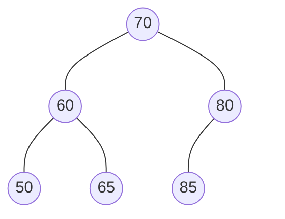

規則：左小右大
* 左子樹的所有鍵值都小於樹根
* 右子樹的所有鍵值都大於樹根
* 左子樹也是BST、右子樹也是BST
* 每個鍵值都不一樣

## 二元搜尋樹的新增

有一BST如下，欲加入48
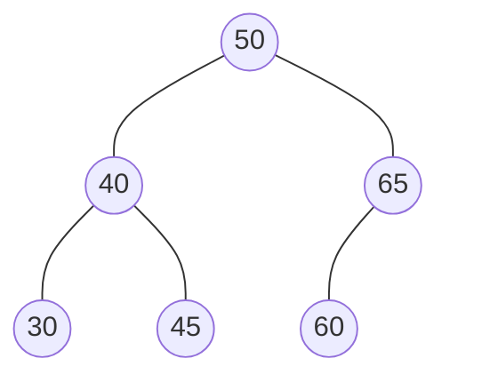

首先檢查樹根，判斷插入節點`48`小於樹根的`50`，因此往樹根左側走

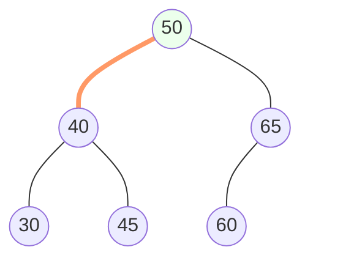

接著，抵達樹根正左方的`40`，因為插入節點`48`大於`40`，因此往`40`右邊走

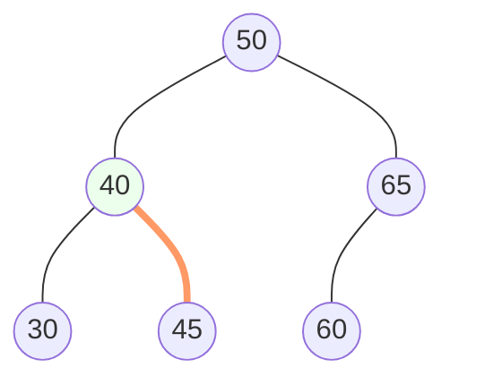

抵達末端節點`45`，插入節點`48`大於`45`，因此在末端節點`45`的右邊設立新節點`48`

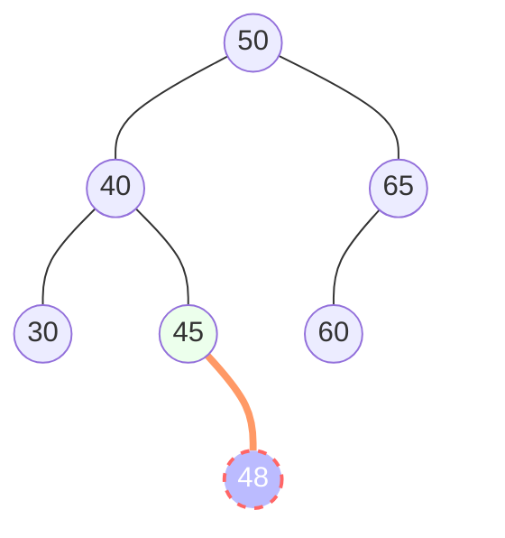

## 二元搜尋樹的搜尋

假設有一BST如下，欲搜尋「55」這一節點

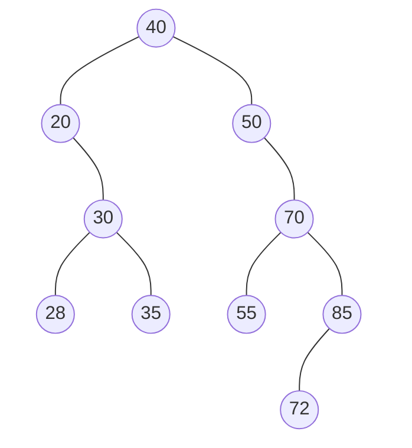

首先，檢查樹根40，搜尋目標55大於40，因此往右走

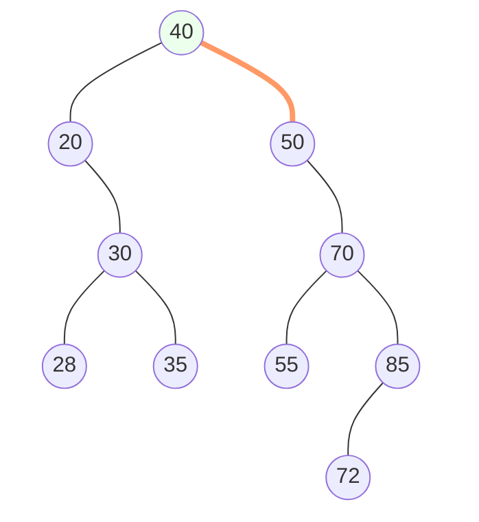

往下檢查「50」，目標55大於50，繼續往右

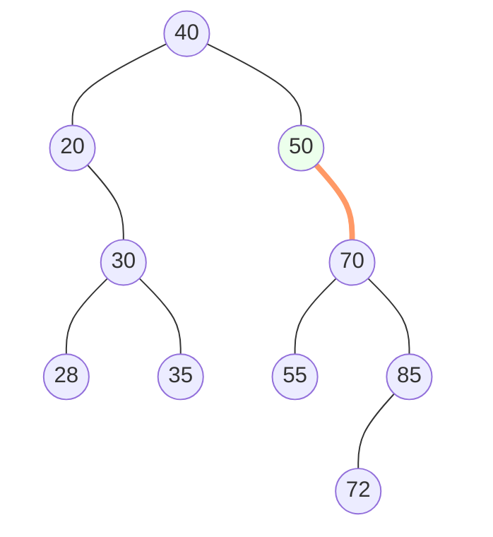

往下檢查「70」目標55小於70，往左

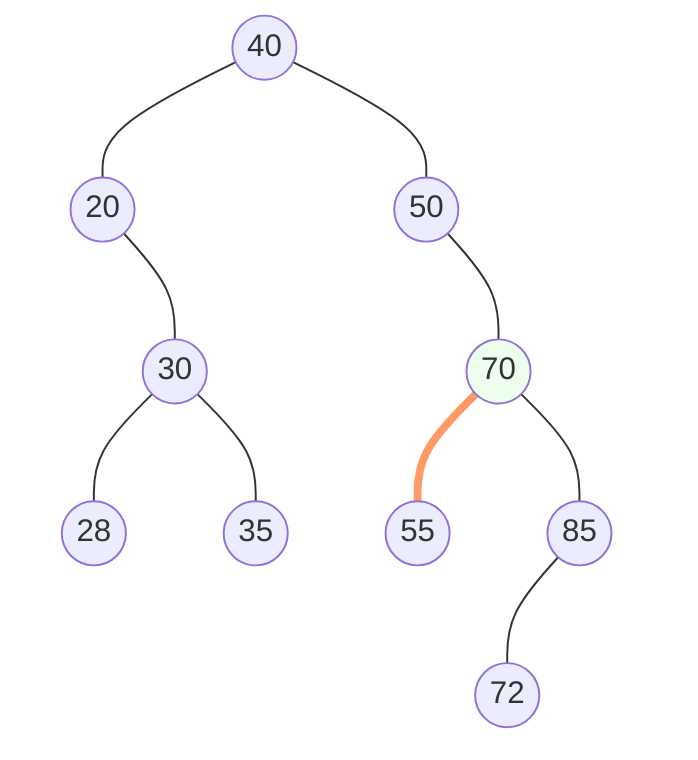

繼續往下，找到節點「55」，目標55與該節點相等，找到目標

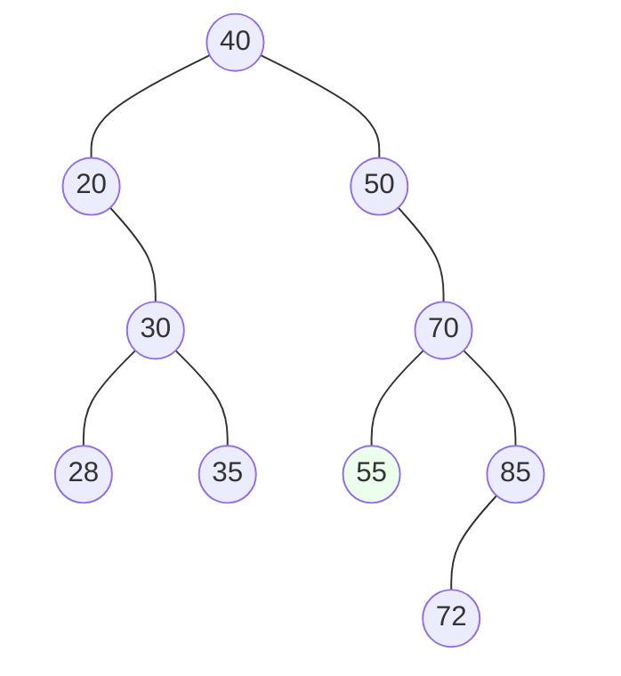

## 二元搜尋樹的刪除

* 若刪除的是樹葉節點，直接刪除就好
* 若非樹葉節點，刪除後要從以下2群找一個替補原先的位置
    * 左子樹中最大的節點
    * 右子樹中最小的節點

例如，以下二元搜尋樹當中，刪除樹根「50」

樹根「50」經刪除後，需要尋找替死鬼，可以選擇從左子樹尋找，或是從右子樹尋找（選擇其中一種就可）

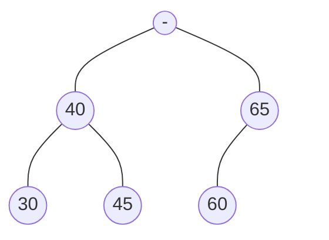

### 方法一：從左子樹尋找最大節點

樹根的左子樹一共有40、30、45共三個節點

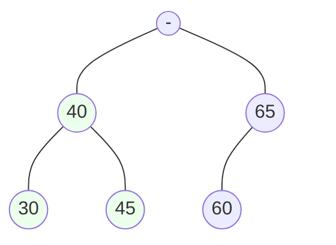

當中，最大的節點是「45」

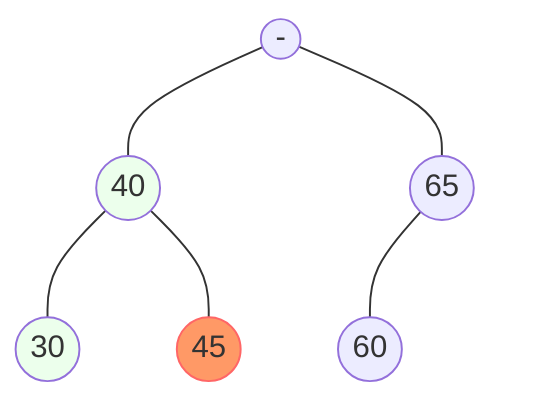

因此，「45」移動位置，成為了新的樹根
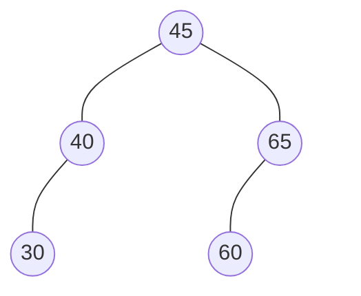

### 方法二：從右子樹尋找最小節點

樹根的右子樹一共有65、60，兩個節點，當中最小的節點是「60」

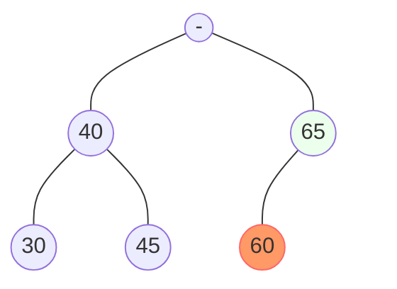

「60」移動位置，成為新的樹根

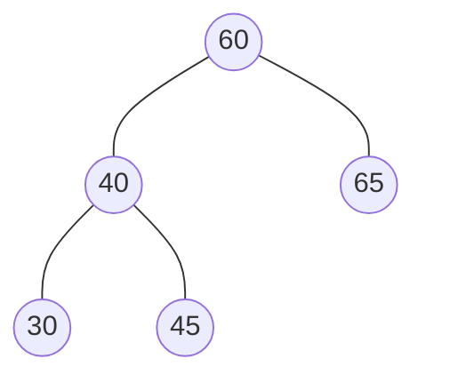
