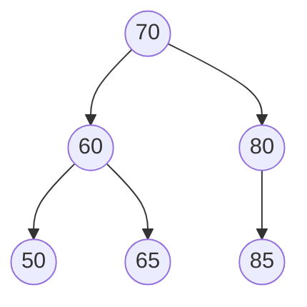
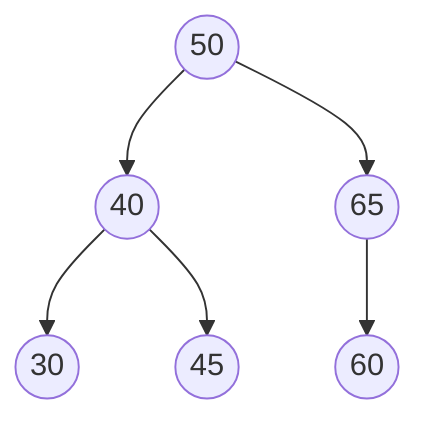
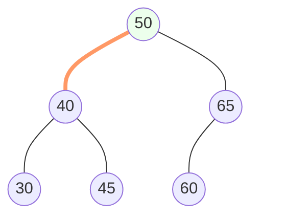
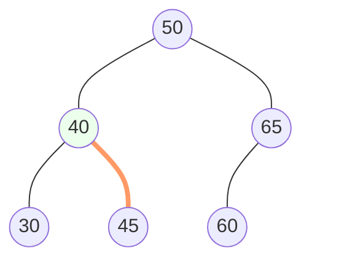
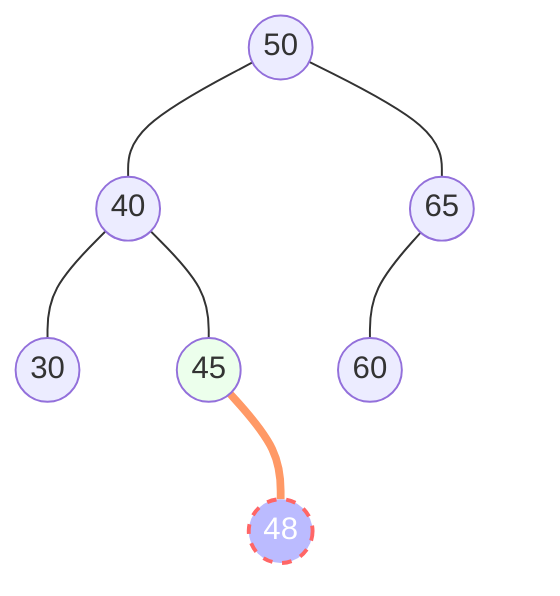

# Binary Search Tree 二元搜尋樹

規則：左小右大
* 左子樹的所有鍵值都小於樹根
* 右子樹的所有鍵值都大於樹根
* 左子樹也是BST、右子樹也是BST
* 每個鍵值都不一樣

## BST的加入

有一BST如下，欲加入48

首先檢查樹根，判斷插入節點`48`小於樹根的`50`，因此往樹根左側走

接著，抵達樹根正左方的`40`，因為插入節點`48`大於`40`，因此往`40`右邊走

抵達末端節點`45`，插入節點`48`大於`45`，因此在末端節點`45`的右邊設立新節點`48`

