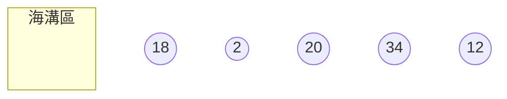
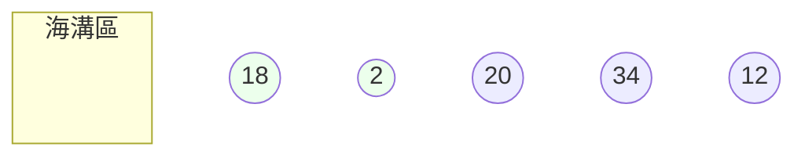
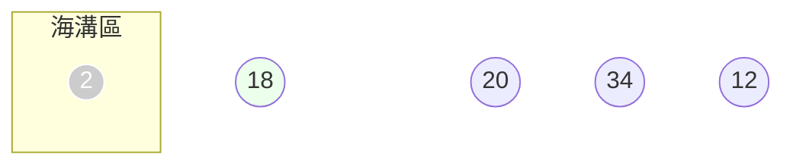
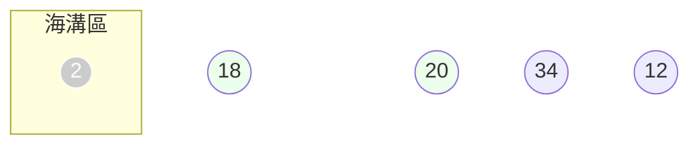
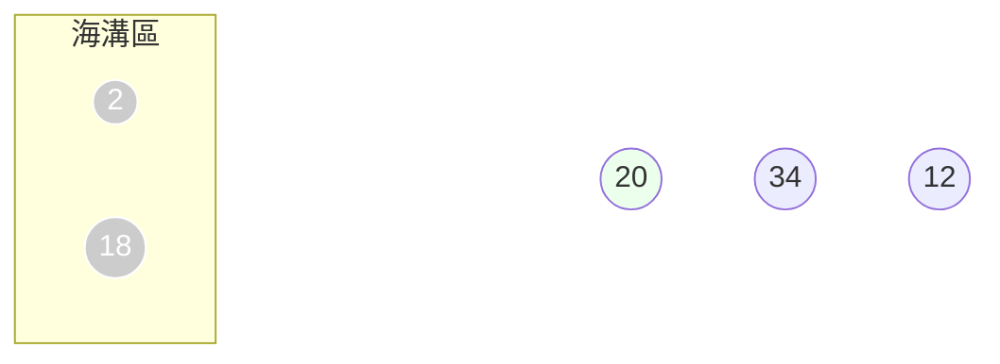
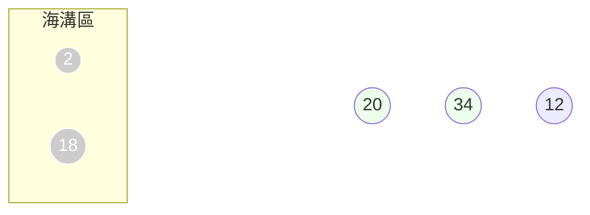
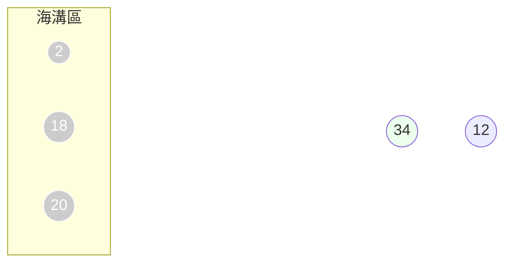
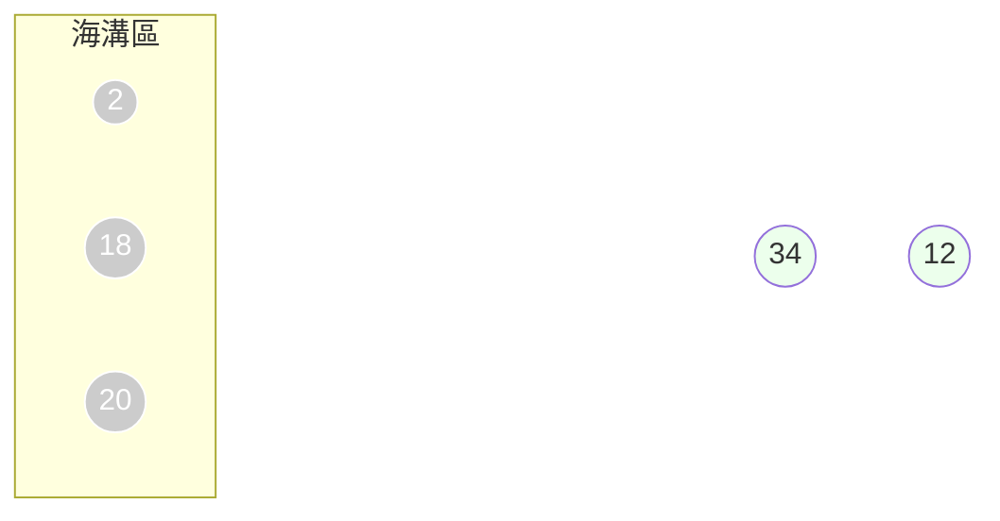
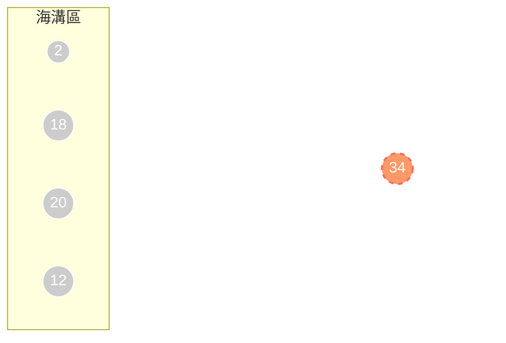

# Bubble Sorting

每輪評選選出最大的那個Bubble（透過比較鄰近元素），之後將其剔除，在執行評選選出最大的，剔除，重複執行到剩下一個（最小的）

泡泡比較的概念：兩兩比較鄰近元素，小的那方下沉到馬里雅納海溝，大的那方浮起來，繼續跟右邊兩兩比較

假設有一組數列`18`、`2`、`20`、`34`、`12`，實作泡泡排序：

首先開始第一輪排序

首先，比較`18`跟`2`

`2`比較小，因此他被扔入了海溝（Sink Down）

接著，比較`18`與`20`

`18`比較小，因此`18`被扔進海溝

繼續比較`20`與`34`

`20`比較小，`20`被丟掉

再比較`34`跟`12`

`12`被丟掉，`34`成為贏家，浮出水面

第一輪評選結果是`34`，`34`因為到陸地上了，
