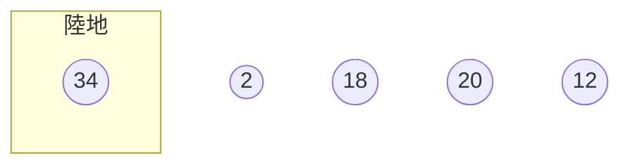
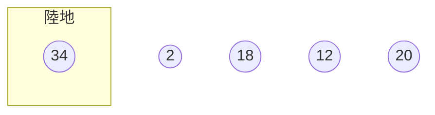
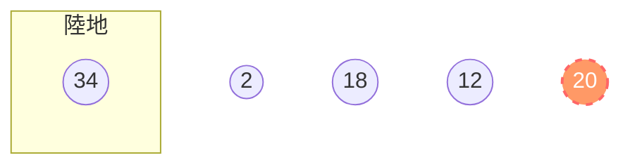
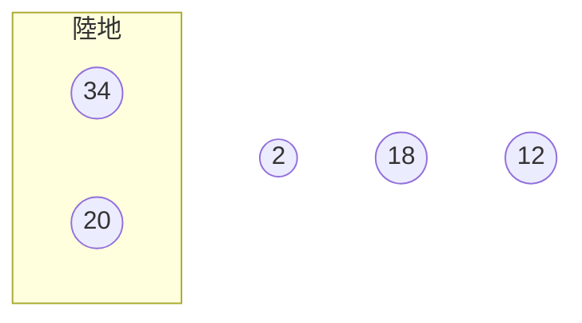
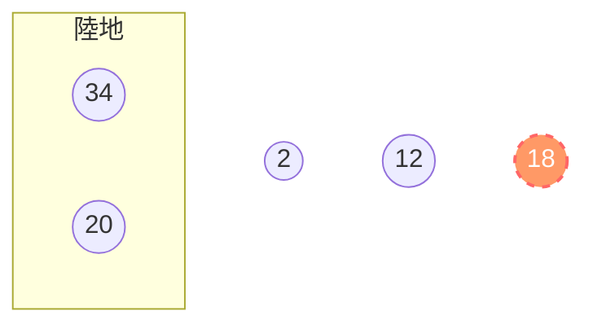

# Bubble Sorting

每輪評選選出最大的那個Bubble（透過比較鄰近元素），之後將其剔除，在執行評選選出最大的，剔除，重複執行到剩下一個（最小的）

泡泡比較的概念：兩兩比較鄰近元素，若前一個比後一個大時，交換排序，然後再繼續跟右邊兩兩比較

假設有一組數列`18`、`2`、`20`、`34`、`12`，實作泡泡排序：

開始第一輪排序


首先，比較`18`跟`2`


`2`比較小，因此`2`跟`18`交換順序


接著，比較`18`與`20`


`18`比較小，順序不變


繼續比較`20`與`34`


`20`比較小，順序不變


再比較`34`跟`12`


`12`被比較小，交換順序


第一輪評選結果最大是`34`，`34`浮出水面


而泡泡浮出水面後就消失在海底了，在陸地上的某處紀錄了`34`，剩下的4個數字繼續評選

## 展開第二輪排序



經過一連串的泡泡交換後，得出新順序如下


這輪換成`20`浮出水面



`20`一樣被移動到陸地，剩下3個再自己排



## 第三輪排序

第三輪經過排序後`18`浮起來了


`18`進入陸地區

```mermaid
flowchart

    subgraph 陸地
        e((34))
        d((20))
        b((18))
    end
    
    a((2))
    c((12)

    classDef popup fill:#f96,stroke:#f66,stroke-width:2px,color:#fff,stroke-dasharray: 5 5
```

## 第四輪排序

第四輪是`12`勝出

```mermaid
flowchart

    subgraph 陸地
        e((34))
        d((20))
        b((18))
    end
    
    a((2))
    c((12):::popup

    classDef popup fill:#f96,stroke:#f66,stroke-width:2px,color:#fff,stroke-dasharray: 5 5
```

`12`進入陸地區

```mermaid
flowchart

    subgraph 陸地
        e((34))
        d((20))
        b((18))
        c((12)
    end
    
    a((2))
    

    classDef popup fill:#f96,stroke:#f66,stroke-width:2px,color:#fff,stroke-dasharray: 5 5
```

### 第五輪

第五輪由於只有一個選手`2`，因此`2`自行勝出

```mermaid
flowchart

    subgraph 陸地
        e((34))
        d((20))
        b((18))
        c((12)
    end
    
    a((2)):::popup
    
    classDef popup fill:#f96,stroke:#f66,stroke-width:2px,color:#fff,stroke-dasharray: 5 5
```

`2`被移入了陸地區

```mermaid
flowchart

    subgraph 陸地
        e((34))
        d((20))
        b((18))
        c((12)
        a((2))
    end
```

### 結算

所有數字都被放入陸地區了，被放入陸地的順序由先到後是：`34`、`20`、`18`、`12`、`2`，因此這組數列由大到小的排序是：

```
34, 20, 18, 12, 2
```
