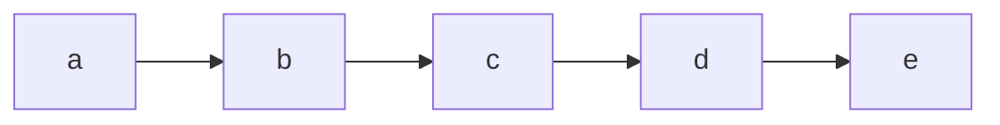
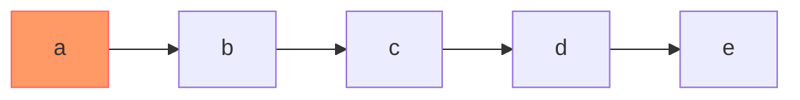
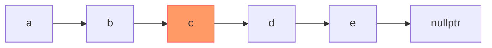
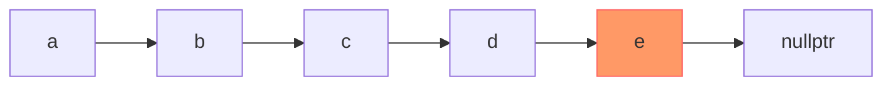
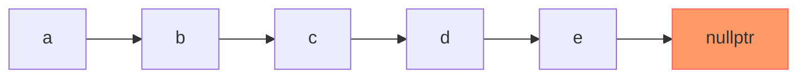
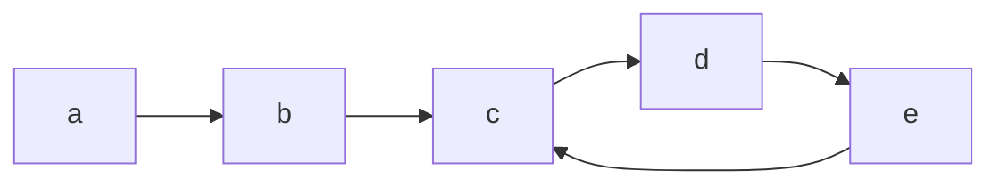

# Fast-slow Pointers 快慢指針

快指針：一次移動兩個節點
慢指針：一次一洞一個節點

以下用兩種Linked List說明**快指針**的移動結果

## 非環狀Linked List

首先，指向第1個節點

然後，移動到第3個節點（快指針一次移動2個節點）

移動到第5個節點

再次移動，會發現指向到nullptr了，說明此List為非環狀結構

假設該List共有p個節點，快指針抵達結尾需要 $p\over2$ 次移動，慢指針需要 $p$ 次移動，兩者的時間複雜度皆為 $O(n)$

## 環狀Linked List

在遇到環之前有p個節點，p為a、b、c，一共3個  
環內中有q個節點，q為c、d、e，共3個

