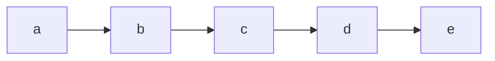
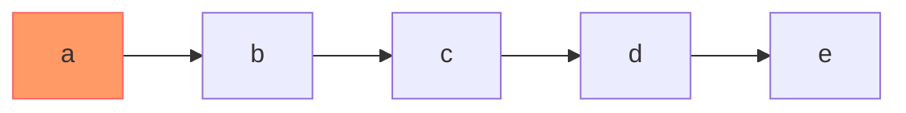
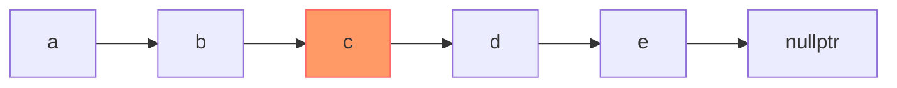
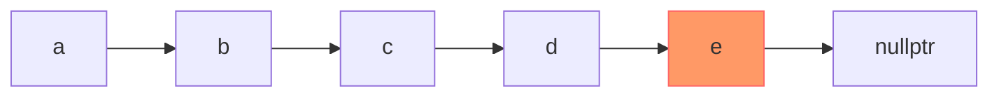
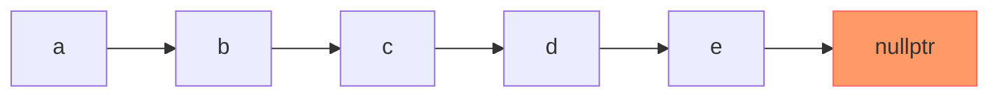
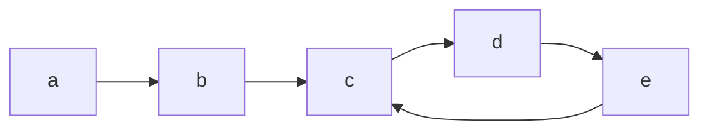

# Fast-slow Pointers 快慢指針

快指針：一次移動兩個節點
慢指針：一次一洞一個節點

以下用兩種Linked List說明**快指針**的移動結果

## 非環狀Linked List

首先，指向第1個節點

然後，移動到第3個節點（快指針一次移動2個節點）

移動到第5個節點

再次移動，會發現指向到nullptr了，說明此List為非環狀結構

假設該List共有p個節點，快指針抵達結尾需要 $p\over2$ 次移動，慢指針需要 $p$ 次移動，兩者的時間複雜度皆為 $O(n)$

## 環狀Linked List

在遇到環之前有p個節點，p為a、b、c，一共3個  
環內中有q個節點，q為c、d、e，共3個

假設一共走了10步 

快指針的路徑為：a->c->e->d->c->e->d->c->e->d->c  
前面直線時是a->c，後面因為遇到了圓環，一直跳針重複c->e->d

慢指針走10步的路徑是：a->b->c->d->e->c->d->e->c->d->e  
直線時走了a->b->c，後面則是一直跳針c->d->e

因為兩造都一直跳針，所以可以知道，快慢指針最終一定會在某個步數相遇，當快指針跟慢指針到達相同位置時，表示此List為環狀

### 計算指針，最終會落在圓環內哪個點

假設一共走了t步距離，直線部分有p個節點（a, b, c），環內有q個節點（c, d, e），在一次又一次的輪迴中，找到快指針的落點 = 慢指針的落點

`(2t - p - 1) % q = (t - p - 1) % q`

首先先計算直線的長度，直線部分一共有p個節點，以上圖來說就是a, b, c一共3個節點，3個節點會構成2個箭頭，也就是2步會走完，因此直線部分需花費的步數為：`p-1`

圓環部分，只要模除`q`就可以知道落點了

快指針的話，因為他一步可以走2倍距離，所以需要`2t`換算實際走了多少步（多少箭頭）

