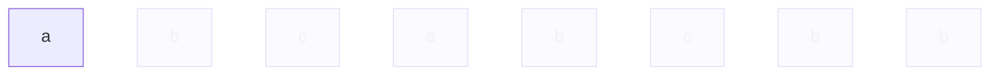
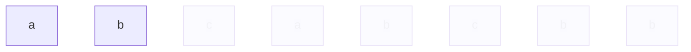
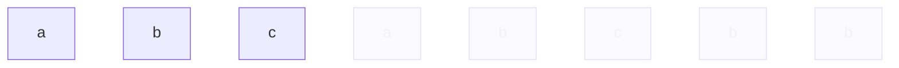
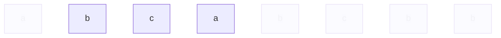
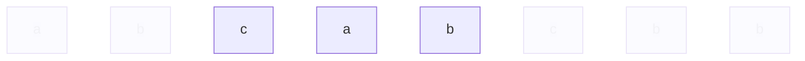
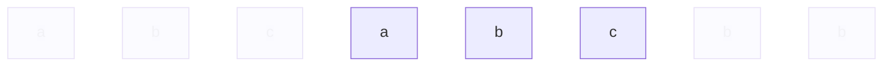
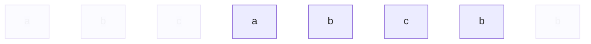
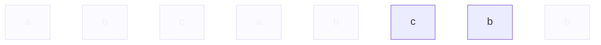
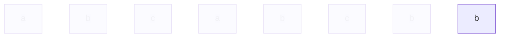

# 滑動視窗

題目：給定一字串，去掉重複出現的字符後，得到出新的字串，計算新字串的長度  
作法：用滑動視窗移動起點/終點，再用哈希表檢查是否出現過

1. 字串題目為`s`，例如`abcabcbb`
2. 定義終點`j`，讓`j`由`0`開始，每當字串遍歷一次，`j`就會加1
3. 定義起點`i`，`i`由`0`開始，只有當符合條件時，`i`才會加一
4. 定義哈希表`m`，`m`儲存出現過的字元跟他的索引位置
5. 定義`ss`描述當下window，也就是s[i]~s[j]

以`s=abcabcbb`為例

### 當遍歷第一次時

| s[j]代表的字元 | j終點 | i起點 | m哈希表 | ss視窗 |
| -- | -- | -- | -- | -- |
| `a`  | 0 | 0 | `{a: 0}` | `a` |

* `j`終點為`0`  
* `i`起點為`0`
* `m`哈希表：首先檢查`s[j]`有沒有在哈希表裡面，得到結果是NO，因此在哈希表裡面放入`{s[j]: j}`，也就是`{a: 0}`
* `ss`視窗：`s[i]`跟`s[j]`都是`s[0]`，因此得出`a`

### 遍歷第二次時

| s[j] | j終點 | i起點 | m哈希表 | ss視窗 |
| --- | -- | -- | -- | -- |
| `a` | 0 | 0 | `{a: 0}` | `a` |
| `b` | 0 | 1 | `{a: 0, b: 1}`| `ab`|

* `j`終點：只要每遍歷一次就會+1，因此j為`1`  
* `m`哈希表：一樣檢查`s[j]`，沒在裡面，放入哈希表中，m成為了`{a: 0, b: 1}`
* `i`起點：只要s[j]人沒在m裡面就不會動，仍然為`0`
* `ss`視窗：`s[0到1]`代表`ab`

### 遍歷到第三次

| s[j] | j終點 | i起點 | m哈希表 | ss視窗 |
| --- | -- | -- | -- | -- |
| `a` | 0 | 0 | `{a: 0}` | `a` |
| `b` | 0 | 1 | `{a: 0, b: 1}`| `ab`|
| `c` | 0 | 2 | `{a: 0, b: 1, c: 2}`| `abc`|

第三次沒什麼好講的

### 到第四次

| s[j] | j終點 | i起點 | m哈希表 | ss視窗 |
| --- | -- | -- | -- | -- |
| `a` | 0 | 0 | `{a: 0}` | `a` |
| `b` | 0 | 1 | `{a: 0, b: 1}`| `ab`|
| `c` | 0 | 2 | `{a: 0, b: 1, c: 2}`| `abc`|
| `a` | 1 | 3 | `{a: 3, b: 1, c: 2}` | `bca` |

* `j`終點：只要每遍歷一次就會+1，因此j為`3`  
* `m`哈希表：檢查`s[j]`，有查到，因此讓m[j]=s[j]，`a: 3`取代`a: 0`，m成為了`{a: 3, b: 1, c: 2}`
* `i`起點：因為發生了更新事件，需要更新起點，新起點的算法是被刪除的人的index+1，剛剛刪除了s[0]，0+1=1，因此更新為`1`
* `ss`視窗：`s[1到3]`代表`bca`

到第4次時，因為有重複的字元，所以將s[0]刪除了，起點發生了變更，新的起點變成了s[0]右邊的人，也就是s[1]=b

### 到第五次

| s[j] | j終點 | i起點 | m哈希表 | ss視窗 |
| --- | -- | -- | -- | -- |
| `a` | 0 | 0 | `{a: 0}` | `a` |
| `b` | 0 | 1 | `{a: 0, b: 1}`| `ab`|
| `c` | 0 | 2 | `{a: 0, b: 1, c: 2}`| `abc`|
| `a` | 1 | 3 | `{a: 3, b: 1, c: 2}` | `bca` |
| `b` | 2 | 4 | `{a: 3, b: 4, c: 2}` | `cab` |

一樣發生了更新事件，`{b: 4}`取代了`{b: 1}`，刪除了s[1]  
因為是s[1]被刪除，被刪除的index為1，1+1=2，2為新的i

### 第六次

| s[j] | j終點 | i起點 | m哈希表 | ss視窗 |
| --- | -- | -- | -- | -- |
| `a` | 0 | 0 | `{a: 0}` | `a` |
| `b` | 0 | 1 | `{a: 0, b: 1}`| `ab`|
| `c` | 0 | 2 | `{a: 0, b: 1, c: 2}`| `abc`|
| `a` | 1 | 3 | `{a: 3, b: 1, c: 2}` | `bca` |
| `b` | 2 | 4 | `{a: 3, b: 4, c: 2}` | `cab` |
| `c` | 3 | 5 | `{a: 3, b: 4, c: 5}` | `abc` |

`{c: 5}`取代了`{c: 2}`，i起點發生變更，被刪除的index是`{c: 2}`的`2`，2+1=3，3為新的i

### 第七次

第7次的動作比較複雜，首先是終點`j`無條件往後移，範圍變成如下

`s[6]`的字元是`b`，先從`{a: 3, b: 4, c: 5}`當中查找是否出現過`b`，答案是有，我們找到`{b: 4}`  
`b`的新index會取代`{b: 4}`，成為了`{b: 6}`，m成為了`{a: 3, b: 6, c: 5}`

新的起點為這次被刪除的`{b: 4}`的4加一去算，4+1=5，新的起點`i`為`5`

`s[6]`的`b`被刪了，而且拿`s[5]`的`a`一起陪葬（即便`a`沒有出現重複），這是因為題目指定需要找連續最長不重複的字串

| s[j] | j終點 | i起點 | m哈希表 | ss視窗 |
| --- | -- | -- | -- | -- |
| `a` | 0 | 0 | `{a: 0}` | `a` |
| `b` | 0 | 1 | `{a: 0, b: 1}`| `ab`|
| `c` | 0 | 2 | `{a: 0, b: 1, c: 2}`| `abc`|
| `a` | 1 | 3 | `{a: 3, b: 1, c: 2}` | `bca` |
| `b` | 2 | 4 | `{a: 3, b: 4, c: 2}` | `cab` |
| `c` | 3 | 5 | `{a: 3, b: 4, c: 5}` | `abc` |
| `b` | 5 | 6 | `{a: 3, b: 6, c: 5}` | `cb` |

### 第八次

| s[j] | j終點 | i起點 | m哈希表 | ss視窗 |
| --- | -- | -- | -- | -- |
| `a` | 0 | 0 | `{a: 0}` | `a` |
| `b` | 0 | 1 | `{a: 0, b: 1}`| `ab`|
| `c` | 0 | 2 | `{a: 0, b: 1, c: 2}`| `abc`|
| `a` | 1 | 3 | `{a: 3, b: 1, c: 2}` | `bca` |
| `b` | 2 | 4 | `{a: 3, b: 4, c: 2}` | `cab` |
| `c` | 3 | 5 | `{a: 3, b: 4, c: 5}` | `abc` |
| `b` | 5 | 6 | `{a: 3, b: 6, c: 5}` | `cb` |
| `b` | 7 | 7 | `{a: 3, b: 7, c: 5}` | `b` |

一樣發生了新`{b: 7}`取代了舊b`{b: 6}`事件，m成為了`{a: 3, b: 7, c: 5}`
因為刪除了`{b: 6}`，6+1=7，新的i起點為`7`

### 評選最長的

綜合看以上八次回圈，整理ss視窗結果如下

* 第1次：`a`
* 第2次：`ab`
* 第3次：`abc`
* 第4次：`bca`
* 第5次：`cab`
* 第6次：`abc`
* 第7次：`cb`
* 第8次：`b`

當中最長的有第3、4、5、6次，都是3位字元，因此得出答案為3 

本方法的時間複雜度為 $O(n)$
空間複雜度 $O(128)$
