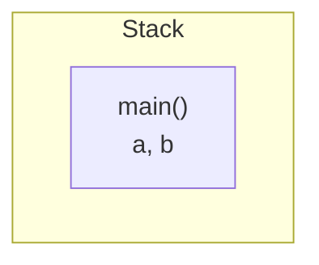
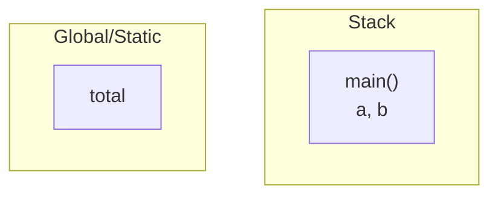

# Dynamic Memory

在運作程式時，電腦的記憶體分為四個部分：

* Code (Text)：程式碼文本
* Static/Global：Static Variable與Global Variable
* Stack：Function Calls與Local Variable
* Heap

這4個部分中，除了Heap以外的其他3個，都不會在程式運作時增長

## 範例解說


```c
int total;

int Square(int x) {
 return x*x;
}

int SquareOfSum(int x, int y) {
  int z = Square(x+y);
  return z;
}

int main {
  int a = 4;
  int b = 8;
  
  total = SquareOfSum(a, b);
  
  printf("output = %d", total);

  return 0;
}
```

①調用`main()`

```diff c
int total;

int Square(int x) {
 return x*x;
}

int SquareOfSum(int x, int y) {
  int z = Square(x+y);
  return z;
}

+int main {
  int a = 4;
  int b = 8;
  
  total = SquareOfSum(a, b);
  
  printf("output = %d", total);

  return 0;
}
```

C++程式的第一步會調用`main()`，在Stack區塊建立一個名為`main()`的堆疊禎（Stack Frame），並且，該堆疊禎會儲存此函數的所有參數以及返回值



②建立全域變數`total`

```diff c
int total;

int Square(int x) {
 return x*x;
}

int SquareOfSum(int x, int y) {
  int z = Square(x+y);
  return z;
}

int main {
  int a = 4;
  int b = 8;
  
+ total = SquareOfSum(a, b);
  
  printf("output = %d", total);

  return 0;
}
```

接下來，在Global/Static區塊，畫出一塊位置，建立全域變數`total`




③調用`SquareOfSum()`

```diff c
int total;

int Square(int x) {
 return x*x;
}

+int SquareOfSum(int x, int y) {
  int z = Square(x+y);
  return z;
}

int main {
  int a = 4;
  int b = 8;
  
  total = SquareOfSum(a, b);
  
  printf("output = %d", total);

  return 0;
}
```
