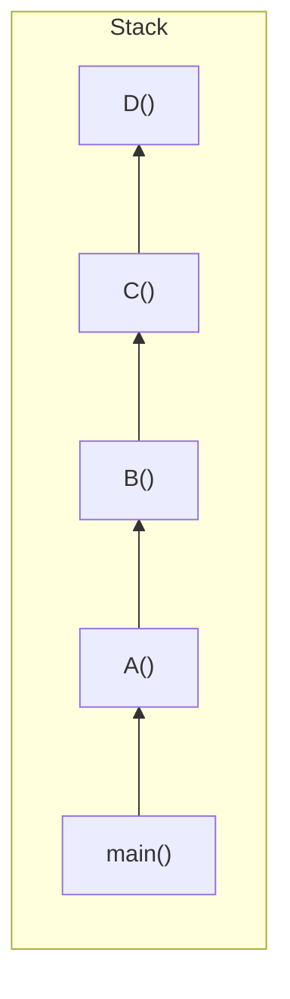
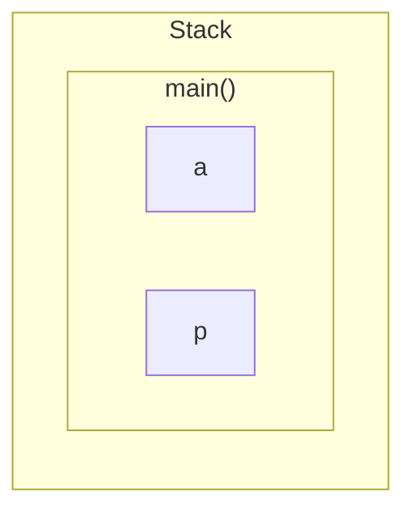
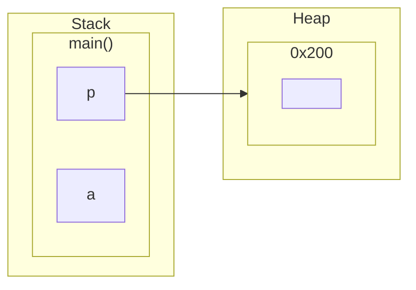
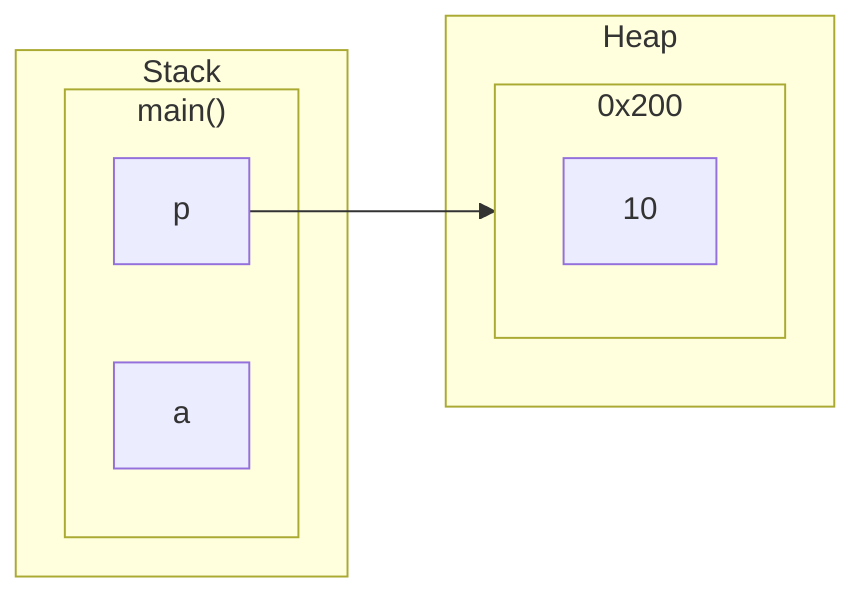
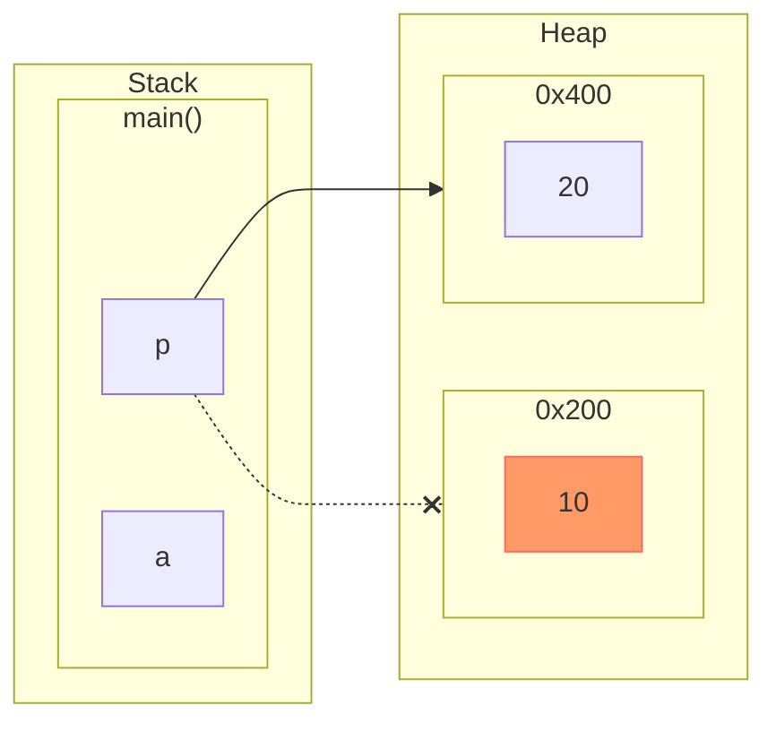
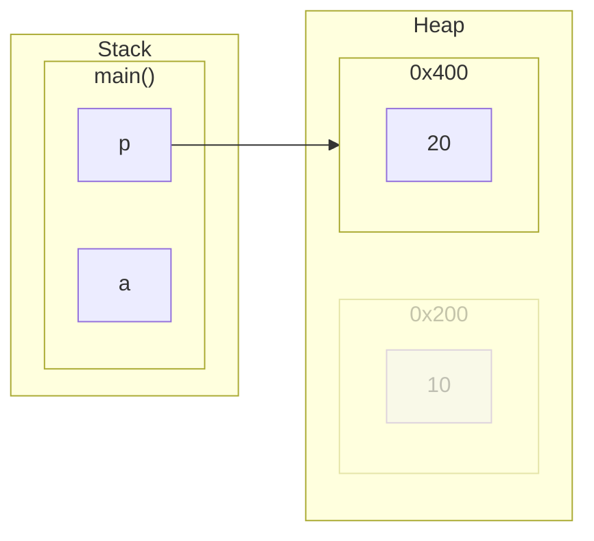

# Dynamic Memory

在運作程式時，電腦的記憶體分為四個部分：

* Code (Text)：程式碼文本
* Static/Global：Static Variable與Global Variable
* Stack：Function Calls與Local Variable
* Heap

這4個部分中，除了Heap以外的其他3個，都不會在程式運作時增長

## 範例解說


```c
int total;

int Square(int x) {
 return x*x;
}

int SquareOfSum(int x, int y) {
  int z = Square(x+y);
  return z;
}

int main {
  int a = 4;
  int b = 8;
  
  total = SquareOfSum(a, b);
  
  printf("output = %d", total);

  return 0;
}
```

### 1. 調用`main()`

```diff c
int total;

int Square(int x) {
 return x*x;
}

int SquareOfSum(int x, int y) {
  int z = Square(x+y);
  return z;
}

+int main {
  int a = 4;
  int b = 8;
  
  total = SquareOfSum(a, b);
  
  printf("output = %d", total);

  return 0;
}
```

C++程式的第一步會調用`main()`，在Stack區塊建立一個名為`main()`的堆疊禎（Stack Frame），並且，該堆疊禎會儲存此函數的所有參數以及返回值


### 2. 建立全域變數`total`

```diff c
int total;

int Square(int x) {
 return x*x;
}

int SquareOfSum(int x, int y) {
  int z = Square(x+y);
  return z;
}

int main {
  int a = 4;
  int b = 8;
  
+ total = SquareOfSum(a, b);
  
  printf("output = %d", total);

  return 0;
}
```

接下來，在Global/Static區塊，畫出一塊位置，建立全域變數`total`


### 3.調用`SquareOfSum()`

```diff c
int total;

int Square(int x) {
 return x*x;
}

+int SquareOfSum(int x, int y) {
  int z = Square(x+y);
  return z;
}

int main {
  int a = 4;
  int b = 8;
  
  total = SquareOfSum(a, b);
  
  printf("output = %d", total);

  return 0;
}
```

由於前一行`total = SquareOfSum(a, b);`，呼叫了`SquareOfSum()`函數，因此，在Stack區塊，推入`SquareOfSum()`的堆疊禎，儲存`SquareOfSum()`的所有參數、區域變數、回傳值：`x`, `y`, `z`


### 4. 調用`Square()`

因為`int z = Square(x+y);`呼叫了`Square()`函數，在Stack區塊，推入`Square()`的堆疊禎，並且儲存參數`x`


```diff c
int total;

+int Square(int x) {
 return x*x;
}

int SquareOfSum(int x, int y) {
  int z = Square(x+y);
  return z;
}

int main {
  int a = 4;
  int b = 8;
  
  total = SquareOfSum(a, b);
  
  printf("output = %d", total);

  return 0;
}
```


### 5. 決定Stack列表上的執行順序

現在，Stack上面一共用3組堆疊禎，電腦不會同時執行這3組，而是先暫停底下2組，優先執行最上面那組，因此，執行順序如下所示：

`main()`暫停、`SquareOfSum()`暫停、執行`Square()`


    
`Square()`計算完畢，Stack清除`Square()`堆疊禎


`SquareOfSum()`復活，執行`SquareOfSum()`


`Square()`計算完畢，Stack清除`Square()`堆疊禎


`main()`復活，繼續執行`main()`


### 6. 執行`printf()`

程式回到了`main()`繼續往下執行剩下的部分

```diff c
int total;

int Square(int x) {
 return x*x;
}

int SquareOfSum(int x, int y) {
  int z = Square(x+y);
  return z;
}

int main {
  int a = 4;
  int b = 8;
  
  total = SquareOfSum(a, b);
  
+ printf("output = %d", total);

  return 0;
}
```

因為遇到了新的函示，因此往Stack放入堆疊禎`printf()`，暫停運作`main()`，`執行printf()`


當`printf()`執行完畢後，Stack刪除`printf()`，並且讓`main()`恢復


### 7. 結束

最後，`main()`執行完畢，Stack清除`main()`


C++結束程式，將Global/Static當中儲存的Global變數`total`清空，Stack跟Global/Static都淨空了


## 堆疊溢出 Stack Overflow

當電腦一開始執行程式時，會預留一些空間給Stack做使用（例如：1mb），但是，假如程式當中出現了無限遞迴呼叫，`A()`調用`B()`、`B()`調用`C()`、`C()`調用`D()`



最開始規劃的1mb會被用完，程式會壞掉，這就是堆疊溢出

## Heap 堆積

跟Stack不同
* Heap沒有固定的大小
* Heap沒有分配/釋放的固定規則，何時分配，何時釋放全交由程序員控制

（Stack讓函數調用時分配Stack，當函數執行完畢職釋放Stack）

Heap也稱為動態內存（Dynamic Memory），使用Heap的行為稱作動態內存分配

## 動態內存分配

C語言當中有關動態內存分配的functions

* `malloc`
* `calloc`
* `realloc`
* `free`

C++語言當中有關動態內存分配的operators
（C++一樣能夠使用C語言的那4個，但是寫C++的話主要還是使用`new`跟`delete`）

* `new`
* `delete`

C語言範例：

首先，宣告一般變數`a`跟指針變數`p`，兩者都會放到Stack當中

```diff c
int main {
+ int a; // 放入Stack
  
+ int *p; // 宣告指針變數p

  return 0;
}
```



使用`malloc`，跟Heap要求一塊2bye的空間，Heap挖了一段空間出來：`0x200`~`0x400`，這段空間的起點是`0x200`，於是malloc回傳`0x200`，Stack當中的指針變數`p`就連結到`0x200`

```diff c
int main {
  int a;
  
  int *p;
  
+ p = (int*)malloc(sizeof(int)); // 跟heap要求一塊空間，分配給p

  return 0;
}
```



透過反引用，對p指向的`0x200`，指派`10`的值

```diff c
int main {
  int a;
  
  int *p;
  
  p = (int*)malloc(sizeof(int));
  
+ *p = 10; // 反引用p，塞值

  return 0;
}
```



### 內存泄露問題

承接上例，再次跟Heap要求一塊內存空間，分配給`p`使用，Heap撥出了`0x400`給我們，然後反引用`p`設定值`0x400`的值為`20`

```diff c
int main {
  int a;
  
  int *p;
  
  p = (int*)malloc(sizeof(int));
  
  *p = 10;
 
+ p = (int*)malloc(sizeof(int)); // 再度跟Heap請求分配一塊空間
+ *p = 20; // 反引用p，塞值

  return 0;
}
```

`p`的指向位置由原先的`0x200`改變為`0x400`，但是`0x200 (10)`這一塊卻仍舊存在於電腦記憶體中，並且沒辦法存取他，`0x200 (10)`成為了一塊找不到卻也刪不掉的垃圾內存



為解決此問題，需要在變更指針位置`0x400`之前，先釋放`0x200`的內容

```diff c
int main {
  int a;
  
  int *p;
  
  p = (int*)malloc(sizeof(int));
  
  *p = 10;
  
+ free(p); // 清空內存;
 
  p = (int*)malloc(sizeof(int));
  *p = 20;

  return 0;
}
```

釋放內存後，再指定新的Heap，就沒有內存洩漏問題了


