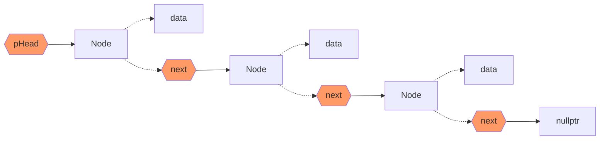
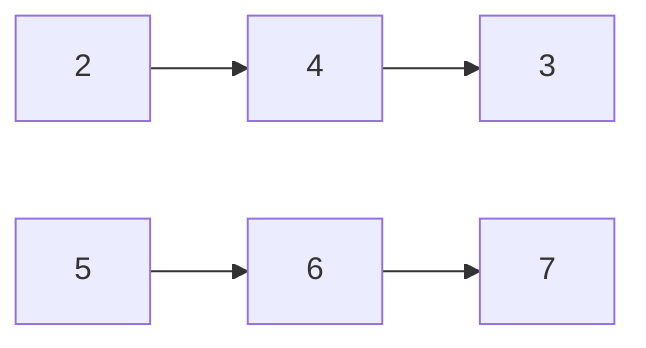
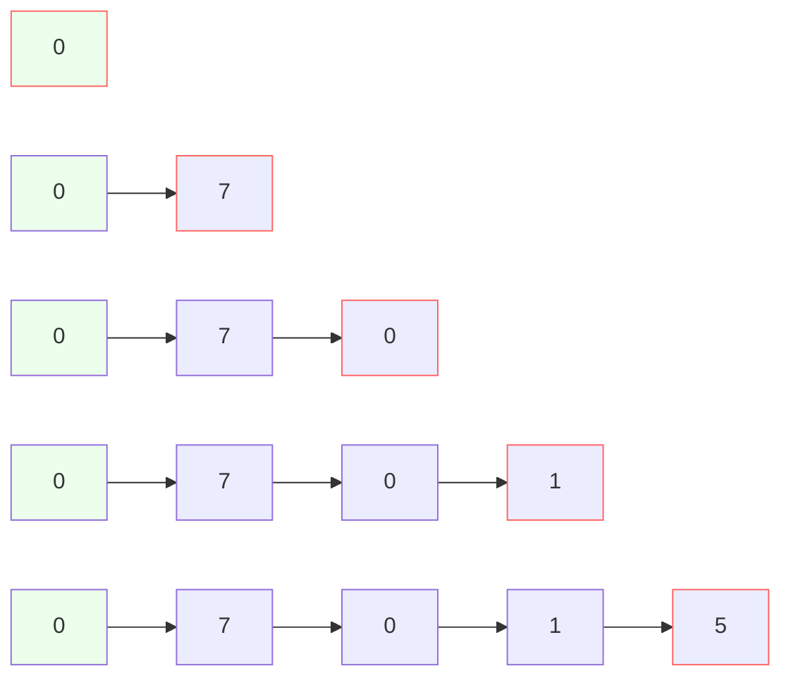

# Linked List

連結串列，由許多節點組成，在空間分配上比傳統陣列彈性，卻也需要多餘空間來儲存節點的指標位置。

一個節點最少需要以下兩個欄位：

* 節點的值
* 下一個節點的記憶體位置

```cpp
struct Node {
  int data; // 該節點的值
  Node* next; // 下一個節點的記憶體位置
}
```

由於串連的特性，因此：

* 需要再有一個獨立指標變數，儲存第一個節點的記憶體位置，稱作`pHead`，表頭指標
* 最後一個節點的`next`連結，會是一個`null`指標



## 練習：建立一個Node
```cpp
struct Node {
    int data;
    Node* next;
}

int main() {
    // 建立一個Node結構體對象
    Node node;
    node.data = 10;
    
    // 建立一個變數儲存第一個Node的指針
    Node *p = &node;
    
    // 使用解引用操作符訪問第一個Node
    cout << (*p).data << endl; // 10
    cout << p->data << endl; // 10
}
```

## 練習：插入Linked List

```cpp
struct Node {
    int data;
    Node* next;
};

// Node** head_ref：指針變數head_ref的指針（一個用來存放指針內存位置的指針），因為如果單單只放指針變數head_ref本人進去，當函示執行結束後會找不到他，所以要再多存一層
void insert_node(Node** head_ref, int new_data) {
    
    if (*head_ref == nullptr) { // *head_ref是Node** head_ref的反指針，因為head_ref是指針變數的指針，所以*head_ref變成赤裸的指針變數
        // 第一項時
        
        
        Node* new_node = new Node();
        new_node->data = new_data;
        new_node->next = nullptr;
        
        *head_ref = new_node;
        
        cout << *head_ref << endl;
    } else {
        // 非第一項時
        cout << "hey" << endl;
        Node* last_node = *head_ref; // 建立暫存變數，尋找最後一項
        while(last_node->next != nullptr) {
            last_node = last_node->next;
        }
        
        
        // 找到最後一項後
        last_node->next = new Node();
        last_node->next->data = new_data;
        last_node->next->next = nullptr;
    }
    
    
    cout << (*head_ref)->data << endl;
    
    return;
}

int main() {
  Node* head_href = nullptr;
    
  insert_node(&head_href, 1); //&head_ref是指針變數head_href的指針
  insert_node(&head_href, 2);
  insert_node(&head_href, 3);
    
  return 0;
}
```

## 練習：加法計算

給定2個Linked List，`l1`與`l2`，各儲存反序的一組數字，相加計算

例如：


342+765=1107，答案為1107

需要考慮的情況：

1. 兩組Linked List的長度不同，例如123+456789
2. 總和具有更多位數：例如99+11=110


```cpp
// 建立名為dummmy的Node，當作第0項
ListNode dummy = ListNode(0);

// 建立tail，儲存最後一項的Node，每計算一個位數tail就會往後移動，初始情況下tail等於dummy的位置
ListNode tail = dummy;


// l1不為空 或 l2不為空 或 carry不為空 時，持續跑回圈
// carry表示十進位後模除10的餘數，例如9+1=12，carry為2
while (l1 || l2 || carry) {
  
  // 計算單元位數的總和
  int sum;
  sum = l1?.val + l2?val + carry;
  
  // 將總和模除10，並且帶入next項
  tail.next = ListNode(sum % 10);
  
  // 往後移動tail的位置
  tail = tail.next;
  
  // 計算carry值
  carry = sum /= 10;
  
  // 分別移動l1, l2的位置
  l1, l2 = l1?.next, l2?.next;
}
```

綠底：dummy位置
紅框：tail位置


